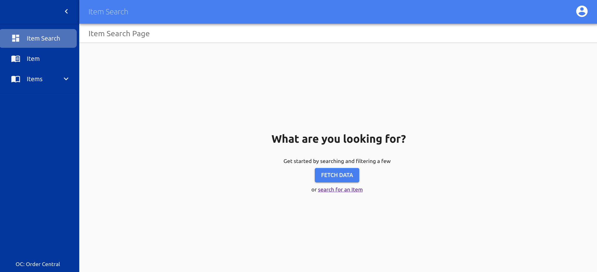
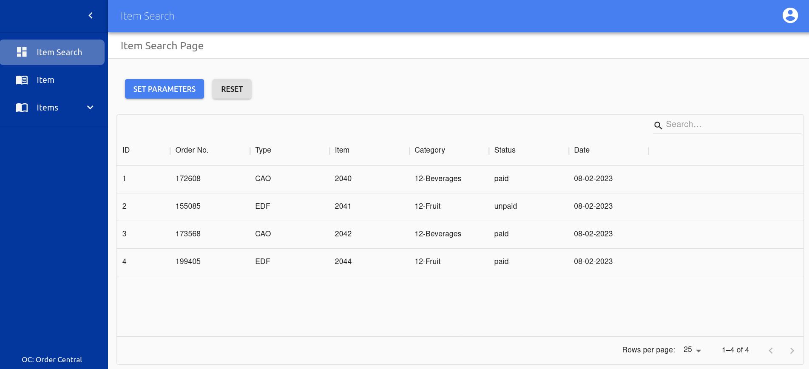
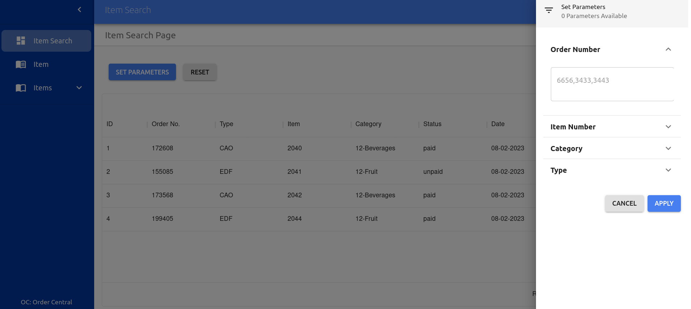
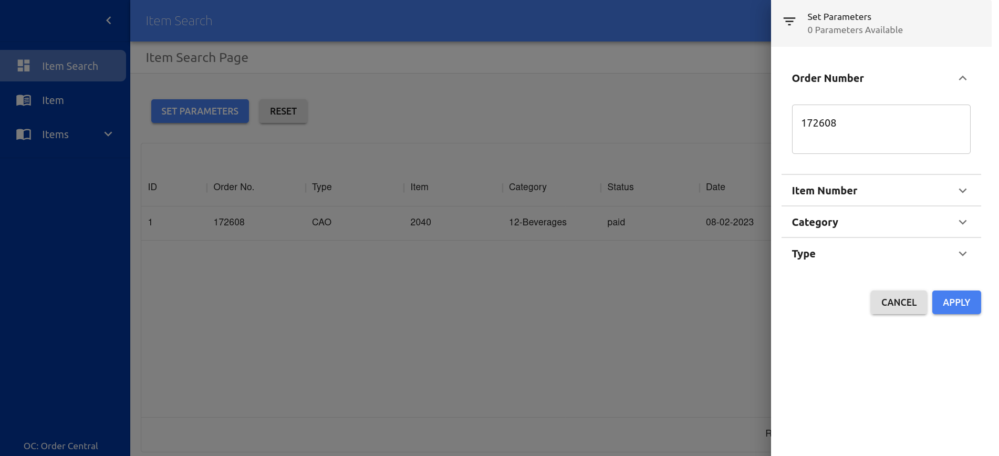
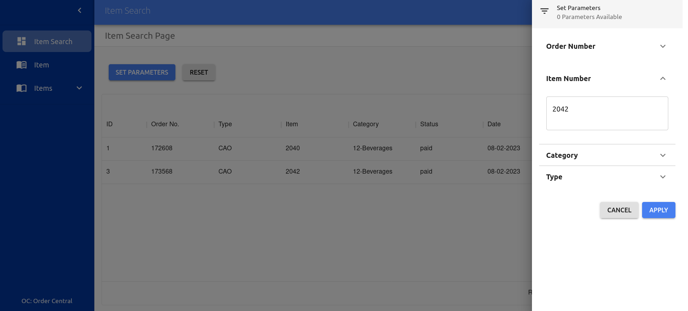

# Table of Contents

- [About the project](#About-the-project)
- [Screenshots](#Screenshots)
- [Functionality](#Functionality)
- [Technologies](#Technologies)
- [How to run](#How-to-run)

# About the project

The project is a dashboard built in React and Typescript with search and filter capabilities

# Screenshots

<details><summary>Landing Page</summary>
<p>

</p>
</details>
<details><summary>Table Data</summary>
<p>

</p>
</details>
<details><summary>Filter Panel</summary>
<p>

</p>
</details>
<details><summary>Search Result</summary>
<p>

</p>
</details>

<details><summary>Search Result 2</summary>
<p>

</p>
</details>

# Functionality

- [x] Ability to search by orderNo, itemNo, category and type
- [x] Ability to display filtered search results

# Technologies

- [React](https://create-react-app.dev/)
- [Typescript](https://www.typescriptlang.org/)
- [MaterialUI](https://mui.com/)
- [Redux](https://redux.js.org/)

# How to run

```bash
# Clone the repo
$ git clone https://github.com/Bascil/react-material-ui-dashboard.git
# cd to the project directory
$ cd react-material-ui-dashboard
# Install dependancies
$ npm i
# npm start to start the server
$ npm start

```
